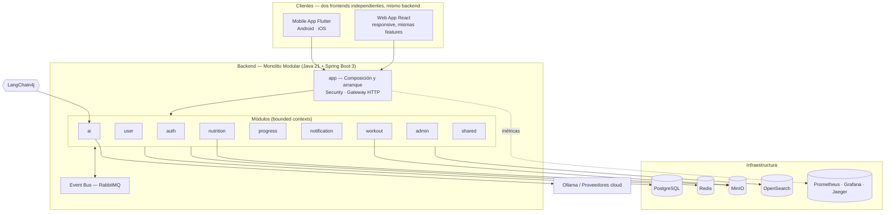
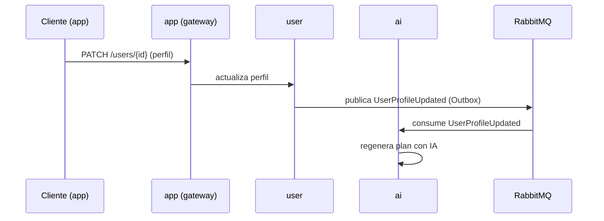

# MiCoach — Arquitectura

> Documento vivo. Se actualiza cuando cambian decisiones importantes.
> Las decisiones individuales se registran en `docs/04-adr/`.

## 1. Resumen

MiCoach es una plataforma de salud y bienestar con IA. Arquitectura elegida:
**Monolito Modular** con **Clean Architecture / Hexagonal** por módulo, comunicación
asíncrona con **eventos** y preparada para extraer microservicios en el futuro sin
reescribir código.



## 2. Decisión clave: Monolito Modular (no microservicios)

**Por qué:** proyecto de curso, no comercial aún, pero con ambición de crecer.

- **Ventaja operativa:** corre en un portátil normal. Un solo proceso, un solo despliegue.
- **Ventaja académica:** demuestra DDD, Clean Architecture, módulos, eventos y buenas
  prácticas SIN el coste de 12 microservicios (red, descubrimiento, orquestación).
- **Camino a microservicios:** cada módulo Gradle es un bounded context con sus propios
  puertos, eventos y tablas. Para extraerlo basta mover el módulo a un repo propio y
  exponer sus eventos por RabbitMQ (ya lo hacemos) + su API por el gateway.
- Ver **ADR-001** para el razonamiento completo.

## 3. Mapa de módulos (bounded contexts)

| Módulo | Responsabilidad | Datos propios |
|---|---|---|
| `shared` | Utilidades, DTOs base, eventos base, errores, seguridad base | — |
| `auth` | Identidad: registro, login, 2FA TOTP, refresh token, OAuth2 social | `users` (solo credenciales) |
| `user` | Perfil completo: patologías, lesiones, medicación, restricciones, preferencias | `user_profiles` y relacionadas |
| `workout` | Ejercicios, músculos, rutinas, generación de entrenamientos | `exercises`, `workouts` |
| `nutrition` | Recetas, planes, macros, sustituciones, lista de compra | `recipes`, `meal_plans` |
| `progress` | Peso, IMC, medidas, fotos, histórico, gráficos | `progress_entries` |
| `notification` | Recordatorios, push (FCM), preferencias de aviso | `notifications`, `reminders` |
| `ai` | Estrategias de IA, prompts versionados, chat, generación | config y caché de respuestas |
| `admin` | Gestión, roles, permisos, auditoría | `roles`, `audit_logs` |
| `app` | Composición de módulos, arranque Spring Boot, migraciones | — |

**Reglas de frontera:**
- Un módulo NO accede a las tablas de otro. Solo a través de sus puertos/API.
- Cambios de estado relevantes se publican como **eventos de dominio** en RabbitMQ.
- `shared` es el único módulo del que todos dependen.

## 4. Estilo por módulo (Clean / Hexagonal)

```
modules/<modulo>/
└── src/main/java/com/micoach/<modulo>/
    ├── <Modulo>Config.java          # wiring (beans, listeners)
    ├── application/                 # casos de uso + puertos (interfaces)
    │   ├── service/                 # implementaciones de casos de uso
    │   └── port/in/ out/            # puertos de entrada/salida
    ├── domain/                      # entidades, value objects, eventos de dominio
    ├── infrastructure/              # adapters: repositorios JPA, clientes REST, bus
    │   ├── persistence/
    │   ├── messaging/
    │   └── client/
    └── presentation/                # controllers REST + DTOs de entrada/salida
```

Dependencias SOLO hacia adentro (domain no conoce a nadie). Casos de uso dependen de
puertos (interfaces), no de adapters → sustituibles (test, cloud, etc.).

## 5. Comunicación

- **Síncrona (consultas/comandos):** REST/OpenAPI desde `app` (gateway HTTP).
- **Asíncrona (eventos de dominio):** RabbitMQ con **Outbox Pattern** (publicación fiable)
  y retries. Ejemplo: `user.updated` → dispara re-generación de planes en `ai`.
- **Correlación:** header `X-Correlation-Id` propagado en toda la cadena para tracing.



## 6. Datos

- **PostgreSQL** = fuente de verdad (modelo relacional). Migraciones **Flyway**.
- **Redis** = caché, sesiones, rate limiting, colas ligeras.
- **MinIO** = objetos (videos, imágenes, GIF) vía API S3.
- **OpenSearch** = búsqueda y analytics (infra opcional por ahora).
- **MongoDB** = NO se usa por ahora. Si surge necesidad real de documentos/analytics de
  alta cardinalidad, se añade justificándolo (ver ADR-002).

## 7. IA

- `ai` usa **LangChain4j** con **Strategy Pattern** (`AiProviderStrategy`): cada proveedor
  (Ollama, OpenAI, Claude, Gemini, Mistral, DeepSeek) implementa la misma interfaz.
- Prompts **versionados** como recursos (`/prompts/*.md`), testables.
- Ollama = opción local gratuita por defecto (`AI_PROVIDER=ollama`).

## 8. Seguridad

JWT corto + refresh token rotatorio, 2FA TOTP, OAuth2 (Google/Apple/Facebook), BCrypt,
AES para datos sensibles de salud, rate limiting (Redis), protección CSRF en web,
auditoría de operaciones críticas, logs sin datos personales (pseudonimización).

## 9. Frontend Mobile (Flutter)

**Mobile-only** (Android/iOS) — la versión web NO es Flutter Web, es un frontend
aparte en React (ver § 10 y ADR-003).

Feature First: cada feature tiene `presentation/`, `application/`, `domain/`,
`infrastructure/`. Inyección y estado con **Riverpod** (providers +
`Notifier`/`AsyncNotifier`; `flutter_bloc` queda declarado pero sin uso, ver
`mobile/README.md` § Decisiones de arquitectura), navegación con **GoRouter** (guarda
de autenticación reactiva a la sesión), red con **Dio** (interceptor de JWT + refresh
automático), storage seguro (`flutter_secure_storage`), Material 3 + Dark Mode.

El **tema es centralizado** en `mobile/lib/core/theme/` para poder re-diseñar sin tocar
las features.

## 10. Frontend Web (React)

Segundo frontend, **independiente del mobile**, contra el mismo backend REST — sin
código compartido entre ambos (solo comparten el contrato de la API). Motivo de la
separación y stack completo: **ADR-003**.

- **React + TypeScript + Vite** (SPA). **TanStack Query** para fetching/cache/
  invalidación (mismo rol que los providers de Riverpod en mobile). **React Router**
  con guarda de autenticación. **Tailwind CSS + shadcn/ui** (DOM real, a diferencia de
  Flutter Web). **React Hook Form + Zod** para formularios. **Axios** con interceptor
  de JWT/refresh (mismo patrón que `ApiClient` en mobile).
- **100% responsive** (mobile-first, un solo layout para teléfono y desktop — no un
  sitio "m." separado).
- Paridad de funcionalidad completa con mobile: mismo orden de features
  (`core → auth → profile → workout → nutrition → progress`), `admin`/`ai` sin
  pantalla propia (mismo criterio que mobile).
- **Tema centralizado** en `web/src/core/theme/` (tokens de Tailwind + variables CSS),
  igual criterio que `mobile/lib/core/theme/`: el diseño (colores, tipografía, nombre
  del proyecto) va a cambiar, así que vive en un solo lugar.
- Plan detallado y checklist de verificación: `docs/00-progress.md` § Fase 3.2.

## 11. Renombrar el proyecto

El nombre actual es **MiCoach** (paquete `com.micoach`). Para cambiarlo:

**Backend (Gradle/Java):**
1. `backend/settings.gradle` → `rootProject.name`.
2. Paquetes `com.micoach.*` → renombrar con IDE (refactor) en `backend/app` y
   `backend/modules/*` (todavía no hay código, es rápido).
3. `backend/app/src/main/resources/application.yml` → `spring.application.name`.

**Frontend Mobile (Flutter):**
1. `mobile/pubspec.yaml` → `name:` y `description:`.
2. `mobile/lib/` → paquete import (ej: `package:micoach_mobile/...`).
3. Tras `flutter create . --org com.micoach --project-name <nuevo>`, los archivos
   android/ios se regeneran con el nuevo nombre (ya no incluye `web/`, ver ADR-003).

**Frontend Web (React) — cuando exista (Fase 3.2):**
1. `web/package.json` → `name`.
2. `web/index.html` → `<title>`.
3. `web/src/core/theme/` → colores/tipografía (mismo punto único que en mobile).

**Infraestructura:**
1. `docker-compose.yml` y `docker-compose.full.yml` → `name:` y nombres de servicio.
2. `.env.example` → variables `*_DB`, `TOTP_ISSUER`, `MAIL_FROM`.

**Docs:** buscar `MiCoach` / `micoach` en `docs/` y `README.md`.

> Si el nuevo nombre cambia también el paquete Java (ej: `com.miempresa.app`), actualiza
> también `--org` en el comando `flutter create` y el `groupId` de Gradle.

## 12. Proyectos de documentación relacionados

- `docs/02-database.md` — modelo de datos (Fase 1).
- `docs/03-api-contracts.md` — contratos REST/eventos (Fase 2, sirve tanto a mobile
  como a la web — el contrato es el mismo para los dos frontends).
- `docs/04-adr/` — decisiones de arquitectura (ver especialmente **ADR-003** para la
  separación mobile/web).
