# KineticOs — Modelo de base de datos

> **Estado: FASE 1 — Sub-entrega 1 COMPLETADA.** Diseño del modelo definido.
> Falta (sub-entregas 2 y 3): migraciones Flyway + seed + verificación.

## Decisiones de base (ya tomadas)

- **Fuente de verdad:** PostgreSQL (relacional).
- **Migraciones:** Flyway, versionadas globalmente `V1__`, `V2__`, ... ubicadas en
  `backend/app/src/main/resources/db/migration/`.
- **Modularidad:** cada módulo modela SOLO sus tablas (el nombre de tabla lleva el prefijo
  del módulo, ej: `user_profiles`, `workout_exercises`, `nutrition_recipes`).
- **Índices:** compuestos para las consultas frecuentes (email de usuario, histórico por
  fecha, búsquedas por músculo/objetivo, etc.). Se definen en las migraciones.
- **Datos sensibles de salud:** columnas cifradas con AES (a nivel de aplicación) o
  referenciadas; nunca en claro en logs.

## Decisiones de diseño de la Fase 1

1. **Enums como `VARCHAR(n)` + `CHECK`** (NO tipos nativos `ENUM` de Postgres).
   Razón: en Flyway modificar un `ENUM` nativo es doloroso (requiere `ALTER TYPE`);
   con `VARCHAR` + `CHECK` la evolución es trivial y encaja con JPA `@Enumerated(STRING)`.
   Cada dominio de valores se documenta en esta página.
2. **Fechas con `TIMESTAMPTZ`**, PK `BIGSERIAL` (aliases `BIGINT GENERATED ALWAYS AS IDENTITY`
   en migraciones modernas), columnas `created_at`/`updated_at` con `DEFAULT now()`.
   `updated_at` lo mantiene la aplicación (JPA `@PreUpdate`), sin triggers, para que las
   migraciones sigan siendo declarativas y predecibles.
3. **JSONB para configuración flexible** (equipamiento, horarios, params de IA, datos de
   notificación). Solo donde el esquema no está fijo; el resto son columnas tipadas.
4. **Fronteras de módulo = prefijo de tabla, NO esquemas separados.** Todo vive en el
   schema `public` de un monolito. Las FK entre módulos están PERMITIDAS a nivel de
   esquema; la frontera se respeta en código (un módulo no consulta tablas de otro).
5. **Catálogos transversales pequeños** (`nutrition_allergens`, `nutrition_diets`) se crean
   en la migración V1 porque el módulo `user` los referencia; el resto de tablas de
   `nutrition` vienen en V3.
6. **45 tablas** en total, agrupadas por módulo. Suficiente para la Fase 2 (backend) sin
   sobre-modelar; se ampliará solo con justificación (ver ADR-002: nada de "ya lo añado por
   si acaso").
7. **Nombres plurales en tablas** (`user_profiles`, `workout_exercises`), columnas `snake_case`,
   FK siempre `<tabla>_id`. Roles de músculo, estado, etc. con valores en minúscula.

## Diagrama Entidad-Relación (completo)

```mermaid
erDiagram
    %% ================= MÓDULO AUTH =================
    AUTH_USERS ||--o{ AUTH_OAUTH_ACCOUNTS : "tiene"
    AUTH_USERS ||--o{ AUTH_REFRESH_TOKENS : "tiene"
    AUTH_USERS ||--o{ AUTH_VERIFICATION_TOKENS : "solicita"

    %% ================= MÓDULO USER =================
    AUTH_USERS ||--|| USER_PROFILES : "tiene perfil"
    USER_PROFILES ||--o{ USER_GOALS : "persigue"
    USER_PROFILES ||--o{ USER_PATHOLOGIES : "sufre"
    USER_PROFILES ||--o{ USER_INJURIES : "registra"
    USER_PROFILES ||--o{ USER_MEDICATIONS : "toma"
    USER_PROFILES ||--o{ USER_FOOD_RESTRICTIONS : "declara"
    USER_FOOD_RESTRICTIONS }o--|| NUTRITION_ALLERGENS : "alérgeno"
    USER_PROFILES ||--o{ USER_DIET_PREFERENCES : "prefiere"
    USER_DIET_PREFERENCES }o--|| NUTRITION_DIETS : "dieta"

    %% ================= MÓDULO ADMIN =================
    ADMIN_ROLES ||--o{ ADMIN_ROLE_PERMISSIONS : "incluye"
    ADMIN_PERMISSIONS ||--o{ ADMIN_ROLE_PERMISSIONS : "asignada a"
    AUTH_USERS ||--o{ ADMIN_USER_ROLES : "tiene rol"
    ADMIN_ROLES ||--o{ ADMIN_USER_ROLES : "otorgado a"
    AUTH_USERS ||--o{ ADMIN_AUDIT_LOGS : "genera"

    %% ================= MÓDULO WORKOUT =================
    WORKOUT_MUSCLES ||--o{ WORKOUT_EXERCISE_MUSCLES : "involucra"
    WORKOUT_EXERCISES ||--o{ WORKOUT_EXERCISE_MUSCLES : "trabaja"
    AUTH_USERS ||--o{ WORKOUT_WORKOUTS : "posee"
    WORKOUT_WORKOUTS ||--o{ WORKOUT_WORKOUT_DAYS : "se divide en"
    WORKOUT_WORKOUT_DAYS ||--o{ WORKOUT_WORKOUT_EXERCISES : "contiene"
    WORKOUT_EXERCISES ||--o{ WORKOUT_WORKOUT_EXERCISES : "usado en"
    AUTH_USERS ||--o{ WORKOUT_SESSIONS : "realiza"
    WORKOUT_WORKOUTS ||--o{ WORKOUT_SESSIONS : "seguida"
    WORKOUT_WORKOUT_DAYS ||--o{ WORKOUT_SESSIONS : "basada en"
    WORKOUT_SESSIONS ||--o{ WORKOUT_SESSION_EXERCISES : "incluye"
    WORKOUT_EXERCISES ||--o{ WORKOUT_SESSION_EXERCISES : "ejecuta"
    WORKOUT_WORKOUT_EXERCISES ||--o{ WORKOUT_SESSION_EXERCISES : "plan de"

    %% ================= MÓDULO NUTRITION =================
    NUTRITION_RECIPES ||--o{ NUTRITION_RECIPE_INGREDIENTS : "compuesta por"
    NUTRITION_INGREDIENTS ||--o{ NUTRITION_RECIPE_INGREDIENTS : "usado en"
    AUTH_USERS ||--o{ NUTRITION_MEAL_PLANS : "recibe"
    NUTRITION_MEAL_PLANS ||--o{ NUTRITION_MEAL_PLAN_DAYS : "se organiza en"
    NUTRITION_MEAL_PLAN_DAYS ||--o{ NUTRITION_MEAL_PLAN_MEALS : "contiene"
    NUTRITION_RECIPES ||--o{ NUTRITION_MEAL_PLAN_MEALS : "incluida en"
    NUTRITION_RECIPES ||--o{ NUTRITION_SUBSTITUTIONS : "tiene variantes"
    NUTRITION_INGREDIENTS ||--o{ NUTRITION_SUBSTITUTIONS : "se sustituye"
    NUTRITION_INGREDIENTS ||--o{ NUTRITION_SUBSTITUTIONS : "sustituye a"
    AUTH_USERS ||--o{ NUTRITION_DAILY_INTAKE : "registra"
    NUTRITION_RECIPES ||--o{ NUTRITION_DAILY_INTAKE : "consumida"
    NUTRITION_MEAL_PLAN_MEALS ||--o{ NUTRITION_DAILY_INTAKE : "planificada"
    AUTH_USERS ||--o{ NUTRITION_SHOPPING_LISTS : "crea"
    NUTRITION_SHOPPING_LISTS ||--o{ NUTRITION_SHOPPING_LIST_ITEMS : "contiene"
    NUTRITION_INGREDIENTS ||--o{ NUTRITION_SHOPPING_LIST_ITEMS : "referenciado"

    %% ================= MÓDULO PROGRESS =================
    AUTH_USERS ||--o{ PROGRESS_ENTRIES : "registra métricas"
    AUTH_USERS ||--o{ PROGRESS_PHOTOS : "sube fotos"

    %% ================= MÓDULO NOTIFICATION =================
    AUTH_USERS ||--o{ NOTIFICATION_NOTIFICATIONS : "recibe"
    AUTH_USERS ||--o{ NOTIFICATION_REMINDERS : "configura"
    AUTH_USERS ||--o{ NOTIFICATION_PREFERENCES : "define"

    %% ================= MÓDULO AI =================
    AUTH_USERS ||--o{ AI_CONVERSATIONS : "chatea"
    AI_CONVERSATIONS ||--o{ AI_CHAT_MESSAGES : "contiene"
    AUTH_USERS ||--o{ AI_GENERATION_LOGS : "genera"
```



---

## Módulo `auth` — Identidad (4 tablas)

Solo credenciales. El perfil de salud vive en `user`. Un mismo `auth_users.id` es la
referencia `user_id` de TODOS los demás módulos (clave del sistema).

### `auth_users`

| Columna | Tipo | Constraints | Descripción |
|---|---|---|---|
| `id` | BIGSERIAL | PK | Identificador |
| `email` | VARCHAR(255) | NOT NULL, UNIQUE | Email normalizado (minúsculas) |
| `password_hash` | VARCHAR(255) | NOT NULL | Hash BCrypt |
| `email_verified_at` | TIMESTAMPTZ | NULL | Null = no verificado |
| `totp_secret` | VARCHAR(255) | NULL | Secreto 2FA cifrado AES en app |
| `totp_enabled` | BOOLEAN | NOT NULL DEFAULT false | 2FA activo |
| `status` | VARCHAR(20) | NOT NULL DEFAULT 'active' CHECK in (active, disabled, blocked, pending_verification) | Estado de cuenta |
| `last_login_at` | TIMESTAMPTZ | NULL | Último acceso |
| `created_at` / `updated_at` | TIMESTAMPTZ | NOT NULL DEFAULT now() | Auditoría |

**Índices:** `email` (único por UNIQUE).

### `auth_oauth_accounts`

Cuentas sociales (Google/Apple/Facebook) vinculadas al usuario.

| Columna | Tipo | Constraints | Descripción |
|---|---|---|---|
| `id` | BIGSERIAL | PK | |
| `user_id` | BIGINT | NOT NULL, FK → auth_users ON DELETE CASCADE | |
| `provider` | VARCHAR(30) | NOT NULL CHECK in (google, apple, facebook) | |
| `provider_subject` | VARCHAR(255) | NOT NULL | Id del usuario en el proveedor |
| `provider_email` | VARCHAR(255) | NULL | |
| `created_at` | TIMESTAMPTZ | NOT NULL DEFAULT now() | |

**Constraints:** UNIQUE (`provider`, `provider_subject`). **Índice:** `user_id`.

### `auth_refresh_tokens`

Tokens de refresco rotatorios. Se almacena el **hash SHA-256** del token, nunca el plano.

| Columna | Tipo | Constraints | Descripción |
|---|---|---|---|
| `id` | BIGSERIAL | PK | |
| `user_id` | BIGINT | NOT NULL, FK → auth_users ON DELETE CASCADE | |
| `token_hash` | VARCHAR(64) | NOT NULL UNIQUE | SHA-256 hex |
| `expires_at` | TIMESTAMPTZ | NOT NULL | |
| `revoked_at` | TIMESTAMPTZ | NULL | Null = vigente |
| `replaced_by_id` | BIGINT | NULL, FK → auth_refresh_tokens (self) | Rotación: token que lo reemplaza |
| `user_agent` | VARCHAR(255) | NULL | |
| `ip_address` | VARCHAR(45) | NULL | Soporta IPv6 |
| `created_at` | TIMESTAMPTZ | NOT NULL DEFAULT now() | |

**Índices:** `token_hash` (único), (`user_id`, `revoked_at`) para limpieza de caducados.

### `auth_verification_tokens`

Tokens de un solo uso para verificar email / resetear password.

| Columna | Tipo | Constraints |
|---|---|---|
| `id` | BIGSERIAL | PK |
| `user_id` | BIGINT | NOT NULL, FK → auth_users ON DELETE CASCADE |
| `purpose` | VARCHAR(30) | NOT NULL CHECK in (email_verification, password_reset, totp_reset) |
| `token_hash` | VARCHAR(64) | NOT NULL UNIQUE |
| `expires_at` | TIMESTAMPTZ | NOT NULL |
| `consumed_at` | TIMESTAMPTZ | NULL |
| `created_at` | TIMESTAMPTZ | NOT NULL DEFAULT now() |

**Índices:** (`user_id`, `purpose`).

---

## Módulo `user` — Perfil de salud (7 tablas)

### `user_profiles`

Perfil completo 1:1 con el usuario. El peso/altura/IMC aquí son valores **iniciales**; el
histórico vive en `progress_entries`.

| Columna | Tipo | Constraints | Descripción |
|---|---|---|---|
| `id` | BIGSERIAL | PK | |
| `user_id` | BIGINT | NOT NULL UNIQUE, FK → auth_users ON DELETE CASCADE | |
| `sex` | VARCHAR(10) | NULL CHECK in (male, female, other) | |
| `birth_date` | DATE | NULL | |
| `height_cm` | NUMERIC(5,2) | NULL CHECK > 0 | |
| `weight_kg` | NUMERIC(6,2) | NULL CHECK > 0 | Peso inicial |
| `activity_level` | VARCHAR(20) | NULL CHECK in (sedentary, light, moderate, active, very_active) | |
| `experience_level` | VARCHAR(20) | NULL CHECK in (beginner, intermediate, advanced) | |
| `equipment` | JSONB | NULL | Equipamiento disponible: ["bodyweight","dumbbell",...] |
| `training_days_per_week` | SMALLINT | NULL CHECK between 1 and 7 | |
| `training_minutes` | SMALLINT | NULL CHECK > 0 | Minutos por sesión |
| `preferred_time` | VARCHAR(20) | NULL CHECK in (morning, midday, afternoon, evening) | |
| `timezone` | VARCHAR(50) | NULL | IANA (ej: America/Argentina/Buenos_Aires) |
| `tdee_calories` | INTEGER | NULL CHECK > 0 | Gasto calórico estimado |
| `dietary_goal` | VARCHAR(20) | NULL CHECK in (lose_fat, gain_muscle, maintain, endurance, health) | Objetivo principal |
| `notes` | VARCHAR(1000) | NULL | |
| `created_at` / `updated_at` | TIMESTAMPTZ | NOT NULL DEFAULT now() | |

**Índices:** `user_id` (único por UNIQUE).

### `user_goals`

Objetivos con prioridad y meta cuantificable. Un usuario puede tener varios.

| Columna | Tipo | Constraints |
|---|---|---|
| `id` | BIGSERIAL | PK |
| `profile_id` | BIGINT | NOT NULL, FK → user_profiles ON DELETE CASCADE |
| `goal_type` | VARCHAR(30) | NOT NULL CHECK in (lose_fat, gain_muscle, maintain_weight, endurance, strength, flexibility, general_health) |
| `target_value` | NUMERIC(8,2) | NULL |
| `target_unit` | VARCHAR(20) | NULL (kg, body_fat_pct, cm, min, sec) |
| `target_date` | DATE | NULL |
| `priority` | SMALLINT | NOT NULL DEFAULT 1 CHECK >= 1 |
| `is_active` | BOOLEAN | NOT NULL DEFAULT true |
| `created_at` / `updated_at` | TIMESTAMPTZ | NOT NULL DEFAULT now() |

**Índices:** (`profile_id`), (`profile_id`, `is_active`).

### `user_pathologies`

Patologías diagnosticadas. `pathology` usa un valor normalizado en minúsculas.

| Columna | Tipo | Constraints |
|---|---|---|
| `id` | BIGSERIAL | PK |
| `profile_id` | BIGINT | NOT NULL, FK → user_profiles ON DELETE CASCADE |
| `pathology` | VARCHAR(150) | NOT NULL (ej: hypertension, diabetes_type_2, asthma) |
| `notes` | VARCHAR(500) | NULL |
| `diagnosed_at` | DATE | NULL |
| `created_at` | TIMESTAMPTZ | NOT NULL DEFAULT now() |

**Índices:** (`profile_id`).

### `user_injuries`

Lesiones con estado para que la IA evite ejercicios de riesgo.

| Columna | Tipo | Constraints |
|---|---|---|
| `id` | BIGSERIAL | PK |
| `profile_id` | BIGINT | NOT NULL, FK → user_profiles ON DELETE CASCADE |
| `body_part` | VARCHAR(100) | NOT NULL (ej: knee, lower_back, shoulder) |
| `injury_type` | VARCHAR(150) | NOT NULL |
| `status` | VARCHAR(20) | NOT NULL DEFAULT 'active' CHECK in (active, recovered, chronic) |
| `notes` | VARCHAR(500) | NULL |
| `occurred_at` | DATE | NULL |
| `created_at` | TIMESTAMPTZ | NOT NULL DEFAULT now() |

**Índices:** (`profile_id`).

### `user_medications`

Medicación actual.

| Columna | Tipo | Constraints |
|---|---|---|
| `id` | BIGSERIAL | PK |
| `profile_id` | BIGINT | NOT NULL, FK → user_profiles ON DELETE CASCADE |
| `medication_name` | VARCHAR(150) | NOT NULL |
| `dosage` | VARCHAR(100) | NULL |
| `schedule` | VARCHAR(200) | NULL (ej: "1 pastilla cada 8 h") |
| `notes` | VARCHAR(500) | NULL |
| `is_active` | BOOLEAN | NOT NULL DEFAULT true |
| `created_at` / `updated_at` | TIMESTAMPTZ | NOT NULL DEFAULT now() |

**Índices:** (`profile_id`).

### `user_food_restrictions`

Alergias/intolerancias del usuario, referenciando el catálogo `nutrition_allergens`.

| Columna | Tipo | Constraints |
|---|---|---|
| `id` | BIGSERIAL | PK |
| `profile_id` | BIGINT | NOT NULL, FK → user_profiles ON DELETE CASCADE |
| `allergen_id` | BIGINT | NULL, FK → nutrition_allergens ON DELETE RESTRICT |
| `restriction_type` | VARCHAR(20) | NOT NULL CHECK in (allergy, intolerance) |
| `severity` | VARCHAR(20) | NULL CHECK in (mild, moderate, severe) |
| `description` | VARCHAR(500) | NULL |
| `created_at` | TIMESTAMPTZ | NOT NULL DEFAULT now() |

**Constraints:** UNIQUE (`profile_id`, `allergen_id`) — válido cuando `allergen_id` no es NULL.

### `user_diet_preferences`

Preferencias de dieta (vegana, keto, ...), referenciando el catálogo `nutrition_diets`.

| Columna | Tipo | Constraints |
|---|---|---|
| `id` | BIGSERIAL | PK |
| `profile_id` | BIGINT | NOT NULL, FK → user_profiles ON DELETE CASCADE |
| `diet_id` | BIGINT | NOT NULL, FK → nutrition_diets ON DELETE RESTRICT |
| `created_at` | TIMESTAMPTZ | NOT NULL DEFAULT now() |

**Constraints:** UNIQUE (`profile_id`, `diet_id`).

---

## Módulo `admin` — Gobernanza (5 tablas)

### `admin_roles`

| Columna | Tipo | Constraints |
|---|---|---|
| `id` | BIGSERIAL | PK |
| `code` | VARCHAR(50) | NOT NULL UNIQUE (ROLE_USER, ROLE_PREMIUM, ROLE_MODERATOR, ROLE_ADMIN) |
| `name` | VARCHAR(100) | NOT NULL |
| `description` | VARCHAR(300) | NULL |
| `is_system` | BOOLEAN | NOT NULL DEFAULT true (roles del sistema no borrables) |
| `created_at` | TIMESTAMPTZ | NOT NULL DEFAULT now() |

### `admin_permissions`

| Columna | Tipo | Constraints |
|---|---|---|
| `id` | BIGSERIAL | PK |
| `code` | VARCHAR(80) | NOT NULL UNIQUE (ej: workout:read, nutrition:write, admin:users:manage) |
| `name` | VARCHAR(150) | NOT NULL |
| `description` | VARCHAR(300) | NULL |
| `created_at` | TIMESTAMPTZ | NOT NULL DEFAULT now() |

### `admin_role_permissions`

| Columna | Tipo | Constraints |
|---|---|---|
| `role_id` | BIGINT | PK + FK → admin_roles ON DELETE CASCADE |
| `permission_id` | BIGINT | PK + FK → admin_permissions ON DELETE CASCADE |

PK compuesta (`role_id`, `permission_id`).

### `admin_user_roles`

| Columna | Tipo | Constraints |
|---|---|---|
| `user_id` | BIGINT | PK + FK → auth_users ON DELETE CASCADE |
| `role_id` | BIGINT | PK + FK → admin_roles ON DELETE CASCADE |
| `assigned_at` | TIMESTAMPTZ | NOT NULL DEFAULT now() |

PK compuesta (`user_id`, `role_id`).

### `admin_audit_logs`

Auditoría de operaciones críticas. `before`/`after` son capturas JSON de la fila afectada
(datos personales **pseudonimizados** antes de loguear).

| Columna | Tipo | Constraints |
|---|---|---|
| `id` | BIGSERIAL | PK |
| `user_id` | BIGINT | NULL, FK → auth_users ON DELETE SET NULL |
| `action` | VARCHAR(100) | NOT NULL (ej: user.profile.updated) |
| `entity_type` | VARCHAR(50) | NOT NULL |
| `entity_id` | BIGINT | NULL |
| `before` / `after` | JSONB | NULL |
| `ip_address` | VARCHAR(45) | NULL |
| `user_agent` | VARCHAR(255) | NULL |
| `correlation_id` | VARCHAR(36) | NULL |
| `created_at` | TIMESTAMPTZ | NOT NULL DEFAULT now() |

**Índices:** (`user_id`, `created_at`), (`entity_type`, `entity_id`), (`created_at`).

---

## Módulo `workout` — Entrenamiento (8 tablas)

### `workout_muscles` (catálogo)

| Columna | Tipo | Constraints |
|---|---|---|
| `id` | BIGSERIAL | PK |
| `code` | VARCHAR(50) | NOT NULL UNIQUE (ej: pecs, lats, quads) |
| `name` | VARCHAR(100) | NOT NULL (ej: Pectoral) |
| `muscle_group` | VARCHAR(50) | NOT NULL (chest, back, legs, shoulders, arms, core) |
| `created_at` | TIMESTAMPTZ | NOT NULL DEFAULT now() |

### `workout_exercises` (catálogo)

| Columna | Tipo | Constraints | Descripción |
|---|---|---|---|
| `id` | BIGSERIAL | PK | |
| `name` | VARCHAR(200) | NOT NULL | |
| `description` | VARCHAR(1000) | NULL | |
| `category` | VARCHAR(30) | NOT NULL CHECK in (strength, cardio, mobility, flexibility, hiit, plyometric) | |
| `equipment` | JSONB | NULL | ["bodyweight","dumbbell","barbell","machine","cable","kettlebell","band"] |
| `difficulty` | VARCHAR(15) | NOT NULL DEFAULT 'beginner' CHECK in (beginner, intermediate, advanced) | |
| `instructions` | TEXT | NULL | Paso a paso |
| `video_url` / `image_url` | VARCHAR(500) | NULL | MinIO/CDN |
| `is_ai_generated` | BOOLEAN | NOT NULL DEFAULT false | Ejercicios creados por IA |
| `is_active` | BOOLEAN | NOT NULL DEFAULT true | Soft delete |
| `created_at` / `updated_at` | TIMESTAMPTZ | NOT NULL DEFAULT now() | |

**Índices:** (`category`), (`difficulty`).

### `workout_exercise_muscles` (junction)

| Columna | Tipo | Constraints |
|---|---|---|
| `exercise_id` | BIGINT | PK + FK → workout_exercises ON DELETE CASCADE |
| `muscle_id` | BIGINT | PK + FK → workout_muscles ON DELETE CASCADE |
| `role` | VARCHAR(20) | NOT NULL DEFAULT 'primary' CHECK in (primary, secondary, stabilizer) |

PK compuesta (`exercise_id`, `muscle_id`, `role`). Permite un músculo con roles distintos
en el mismo ejercicio (poco común) y evita duplicados.

### `workout_workouts` (rutinas/plantillas)

| Columna | Tipo | Constraints | Descripción |
|---|---|---|---|
| `id` | BIGSERIAL | PK | |
| `user_id` | BIGINT | NULL, FK → auth_users ON DELETE SET NULL | NULL = plantilla global (admin/IA) |
| `name` | VARCHAR(200) | NOT NULL | |
| `description` | VARCHAR(1000) | NULL | |
| `objective` | VARCHAR(30) | NULL CHECK in (lose_fat, gain_muscle, maintain, endurance, strength, general_health) | |
| `level` | VARCHAR(15) | NULL CHECK in (beginner, intermediate, advanced) | |
| `duration_weeks` | SMALLINT | NULL | |
| `is_template` | BOOLEAN | NOT NULL DEFAULT false | Plantilla reutilizable |
| `is_ai_generated` | BOOLEAN | NOT NULL DEFAULT false | |
| `status` | VARCHAR(20) | NOT NULL DEFAULT 'active' CHECK in (active, archived) | |
| `created_at` / `updated_at` | TIMESTAMPTZ | NOT NULL DEFAULT now() | |

**Índices:** (`user_id`), (`is_template`, `objective`).

### `workout_workout_days`

| Columna | Tipo | Constraints |
|---|---|---|
| `id` | BIGSERIAL | PK |
| `workout_id` | BIGINT | NOT NULL, FK → workout_workouts ON DELETE CASCADE |
| `day_index` | SMALLINT | NOT NULL CHECK >= 1 |
| `name` | VARCHAR(100) | NULL (ej: "Día 1 — Push") |
| `is_rest_day` | BOOLEAN | NOT NULL DEFAULT false |
| `created_at` | TIMESTAMPTZ | NOT NULL DEFAULT now() |

**Constraints:** UNIQUE (`workout_id`, `day_index`).

### `workout_workout_exercises`

| Columna | Tipo | Constraints |
|---|---|---|
| `id` | BIGSERIAL | PK |
| `workout_day_id` | BIGINT | NOT NULL, FK → workout_workout_days ON DELETE CASCADE |
| `exercise_id` | BIGINT | NOT NULL, FK → workout_exercises ON DELETE RESTRICT |
| `order_index` | SMALLINT | NOT NULL CHECK >= 1 |
| `sets` | SMALLINT | NOT NULL DEFAULT 1 CHECK >= 1 |
| `reps_min` / `reps_max` | SMALLINT | NULL |
| `rest_seconds` | SMALLINT | NULL |
| `intensity_percent` | SMALLINT | NULL CHECK between 1 and 100 (%1RM) |
| `tempo` | VARCHAR(30) | NULL (ej: "3-1-1") |
| `notes` | VARCHAR(500) | NULL |

**Índices:** (`workout_day_id`, `order_index`).

### `workout_sessions`

Sesión realizada (historial de entrenamiento).

| Columna | Tipo | Constraints |
|---|---|---|
| `id` | BIGSERIAL | PK |
| `user_id` | BIGINT | NOT NULL, FK → auth_users ON DELETE CASCADE |
| `workout_id` | BIGINT | NULL, FK → workout_workouts ON DELETE SET NULL |
| `workout_day_id` | BIGINT | NULL, FK → workout_workout_days ON DELETE SET NULL |
| `status` | VARCHAR(20) | NOT NULL DEFAULT 'in_progress' CHECK in (planned, in_progress, completed, aborted) |
| `started_at` | TIMESTAMPTZ | NULL |
| `completed_at` | TIMESTAMPTZ | NULL |
| `duration_seconds` | INTEGER | NULL |
| `notes` | VARCHAR(500) | NULL |
| `created_at` / `updated_at` | TIMESTAMPTZ | NOT NULL DEFAULT now() |

**Índices:** (`user_id`, `started_at` DESC), (`status`).

### `workout_session_exercises`

Ejecución real por ejercicio dentro de una sesión.

| Columna | Tipo | Constraints |
|---|---|---|
| `id` | BIGSERIAL | PK |
| `session_id` | BIGINT | NOT NULL, FK → workout_sessions ON DELETE CASCADE |
| `workout_exercise_id` | BIGINT | NULL, FK → workout_workout_exercises ON DELETE SET NULL |
| `exercise_id` | BIGINT | NOT NULL, FK → workout_exercises ON DELETE RESTRICT |
| `sets_done` | SMALLINT | NOT NULL DEFAULT 0 |
| `weight_kg` | NUMERIC(6,2) | NULL |
| `reps` | SMALLINT | NULL |
| `rpe` | SMALLINT | NULL CHECK between 1 and 10 |
| `duration_seconds` | INTEGER | NULL (cardio) |
| `distance_meters` | INTEGER | NULL (cardio) |
| `notes` | VARCHAR(500) | NULL |

**Índices:** (`session_id`).

---

## Módulo `nutrition` — Alimentación (12 tablas, 2 ya en V1)

### `nutrition_allergens` (catálogo — creada en V1)

| Columna | Tipo | Constraints |
|---|---|---|
| `id` | BIGSERIAL | PK |
| `code` | VARCHAR(50) | NOT NULL UNIQUE |
| `name` | VARCHAR(100) | NOT NULL |
| `created_at` | TIMESTAMPTZ | NOT NULL DEFAULT now() |

Seed: gluten, lactose, peanut, tree_nut, egg, soy, fish, shellfish, sesame, celery, mustard, sulfites.

### `nutrition_diets` (catálogo — creada en V1)

| Columna | Tipo | Constraints |
|---|---|---|
| `id` | BIGSERIAL | PK |
| `code` | VARCHAR(50) | NOT NULL UNIQUE |
| `name` | VARCHAR(100) | NOT NULL |
| `description` | VARCHAR(300) | NULL |
| `created_at` | TIMESTAMPTZ | NOT NULL DEFAULT now() |

Seed: vegan, vegetarian, pescatarian, keto, low_carb, gluten_free, dairy_free, halal, kosher.

### `nutrition_ingredients` (catálogo de alimentos)

| Columna | Tipo | Constraints |
|---|---|---|
| `id` | BIGSERIAL | PK |
| `name` | VARCHAR(200) | NOT NULL UNIQUE |
| `category` | VARCHAR(50) | NULL (proteins, carbs, fats, vegetables, fruits, dairy, grains, legumes, nuts, condiments, beverages, other) |
| `base_unit` | VARCHAR(20) | NOT NULL DEFAULT 'g' |
| `calories_per_100g` | NUMERIC(8,2) | NOT NULL DEFAULT 0 CHECK >= 0 |
| `protein_per_100g` | NUMERIC(8,2) | NOT NULL DEFAULT 0 CHECK >= 0 |
| `carbs_per_100g` | NUMERIC(8,2) | NOT NULL DEFAULT 0 CHECK >= 0 |
| `fat_per_100g` | NUMERIC(8,2) | NOT NULL DEFAULT 0 CHECK >= 0 |
| `fiber_per_100g` | NUMERIC(8,2) | NOT NULL DEFAULT 0 CHECK >= 0 |
| `is_ai_generated` | BOOLEAN | NOT NULL DEFAULT false |
| `is_active` | BOOLEAN | NOT NULL DEFAULT true |
| `created_at` / `updated_at` | TIMESTAMPTZ | NOT NULL DEFAULT now() |

**Índices:** (`category`).

### `nutrition_recipes`

| Columna | Tipo | Constraints |
|---|---|---|
| `id` | BIGSERIAL | PK |
| `name` | VARCHAR(200) | NOT NULL |
| `description` | VARCHAR(1000) | NULL |
| `meal_category` | VARCHAR(20) | NOT NULL CHECK in (breakfast, lunch, dinner, snack, dessert, drink) |
| `difficulty` | VARCHAR(15) | NULL CHECK in (easy, medium, hard) |
| `servings` | SMALLINT | NOT NULL DEFAULT 1 CHECK >= 1 |
| `prep_time_min` / `cook_time_min` | SMALLINT | NULL |
| `calories_per_serving` | NUMERIC(8,2) | NULL |
| `protein_per_serving` | NUMERIC(8,2) | NULL |
| `carbs_per_serving` | NUMERIC(8,2) | NULL |
| `fat_per_serving` | NUMERIC(8,2) | NULL |
| `fiber_per_serving` | NUMERIC(8,2) | NULL |
| `instructions` | TEXT | NULL |
| `image_url` | VARCHAR(500) | NULL |
| `is_ai_generated` | BOOLEAN | NOT NULL DEFAULT false |
| `is_active` | BOOLEAN | NOT NULL DEFAULT true |
| `created_at` / `updated_at` | TIMESTAMPTZ | NOT NULL DEFAULT now() |

**Índices:** (`meal_category`).

### `nutrition_recipe_ingredients` (junction)

| Columna | Tipo | Constraints |
|---|---|---|
| `recipe_id` | BIGINT | PK + FK → nutrition_recipes ON DELETE CASCADE |
| `ingredient_id` | BIGINT | PK + FK → nutrition_ingredients ON DELETE RESTRICT |
| `amount` | NUMERIC(10,2) | NOT NULL CHECK > 0 |
| `unit` | VARCHAR(20) | NOT NULL DEFAULT 'g' (g, ml, unit, tbsp, tsp, cup, slice) |
| `order_index` | SMALLINT | NOT NULL DEFAULT 1 |

PK compuesta (`recipe_id`, `ingredient_id`).

### `nutrition_meal_plans`

| Columna | Tipo | Constraints |
|---|---|---|
| `id` | BIGSERIAL | PK |
| `user_id` | BIGINT | NOT NULL, FK → auth_users ON DELETE CASCADE |
| `name` | VARCHAR(200) | NOT NULL |
| `description` | VARCHAR(1000) | NULL |
| `start_date` / `end_date` | DATE | NOT NULL |
| `target_calories` | INTEGER | NULL |
| `target_protein_g` / `target_carbs_g` / `target_fat_g` | NUMERIC(8,2) | NULL |
| `is_ai_generated` | BOOLEAN | NOT NULL DEFAULT false |
| `status` | VARCHAR(20) | NOT NULL DEFAULT 'active' CHECK in (draft, active, completed, cancelled) |
| `created_at` / `updated_at` | TIMESTAMPTZ | NOT NULL DEFAULT now() |

**Índices:** (`user_id`), (`start_date`, `end_date`).

### `nutrition_meal_plan_days`

| Columna | Tipo | Constraints |
|---|---|---|
| `id` | BIGSERIAL | PK |
| `meal_plan_id` | BIGINT | NOT NULL, FK → nutrition_meal_plans ON DELETE CASCADE |
| `plan_date` | DATE | NOT NULL |

**Constraints:** UNIQUE (`meal_plan_id`, `plan_date`). **Índice:** (`plan_date`).

### `nutrition_meal_plan_meals`

| Columna | Tipo | Constraints |
|---|---|---|
| `id` | BIGSERIAL | PK |
| `meal_plan_day_id` | BIGINT | NOT NULL, FK → nutrition_meal_plan_days ON DELETE CASCADE |
| `recipe_id` | BIGINT | NULL, FK → nutrition_recipes ON DELETE SET NULL |
| `meal_type` | VARCHAR(20) | NOT NULL CHECK in (breakfast, lunch, dinner, snack) |
| `order_index` | SMALLINT | NOT NULL DEFAULT 1 |
| `servings` | NUMERIC(5,2) | NOT NULL DEFAULT 1 |
| `notes` | VARCHAR(500) | NULL |

**Índices:** (`meal_plan_day_id`).

### `nutrition_substitutions`

Sustituciones inteligentes (por alergia, intolerancia, preferencia o falta de stock).

| Columna | Tipo | Constraints |
|---|---|---|
| `id` | BIGSERIAL | PK |
| `recipe_id` | BIGINT | NULL, FK → nutrition_recipes ON DELETE SET NULL |
| `ingredient_id` | BIGINT | NOT NULL, FK → nutrition_ingredients ON DELETE RESTRICT |
| `substitute_ingredient_id` | BIGINT | NOT NULL, FK → nutrition_ingredients ON DELETE RESTRICT |
| `reason` | VARCHAR(30) | NULL CHECK in (allergy, intolerance, unavailable, preference) |
| `notes` | VARCHAR(500) | NULL |
| `created_at` | TIMESTAMPTZ | NOT NULL DEFAULT now() |

**Índices:** (`ingredient_id`). CHECK `ingredient_id <> substitute_ingredient_id`.

### `nutrition_daily_intake` (diario alimentario)

| Columna | Tipo | Constraints |
|---|---|---|
| `id` | BIGSERIAL | PK |
| `user_id` | BIGINT | NOT NULL, FK → auth_users ON DELETE CASCADE |
| `meal_plan_meal_id` | BIGINT | NULL, FK → nutrition_meal_plan_meals ON DELETE SET NULL |
| `recipe_id` | BIGINT | NULL, FK → nutrition_recipes ON DELETE SET NULL |
| `food_date` | DATE | NOT NULL |
| `meal_type` | VARCHAR(20) | NOT NULL CHECK in (breakfast, lunch, dinner, snack) |
| `amount` | NUMERIC(8,2) | NULL (porción consumida) |
| `calories` | NUMERIC(8,2) | NULL (calculado) |
| `protein_g` / `carbs_g` / `fat_g` | NUMERIC(8,2) | NULL |
| `consumed_at` | TIMESTAMPTZ | NOT NULL DEFAULT now() |

**Índices:** (`user_id`, `food_date`).

### `nutrition_shopping_lists`

| Columna | Tipo | Constraints |
|---|---|---|
| `id` | BIGSERIAL | PK |
| `user_id` | BIGINT | NOT NULL, FK → auth_users ON DELETE CASCADE |
| `name` | VARCHAR(200) | NOT NULL DEFAULT 'Lista de la semana' |
| `week_start` | DATE | NULL |
| `created_at` / `updated_at` | TIMESTAMPTZ | NOT NULL DEFAULT now() |

**Índices:** (`user_id`).

### `nutrition_shopping_list_items`

| Columna | Tipo | Constraints |
|---|---|---|
| `id` | BIGSERIAL | PK |
| `shopping_list_id` | BIGINT | NOT NULL, FK → nutrition_shopping_lists ON DELETE CASCADE |
| `ingredient_id` | BIGINT | NULL, FK → nutrition_ingredients ON DELETE SET NULL |
| `item_name` | VARCHAR(200) | NULL (ítem libre) |
| `amount` | NUMERIC(10,2) | NULL |
| `unit` | VARCHAR(20) | NULL |
| `category` | VARCHAR(50) | NULL (agrupación al mostrar) |
| `is_checked` | BOOLEAN | NOT NULL DEFAULT false |

**Índices:** (`shopping_list_id`).

---

## Módulo `progress` — Seguimiento (2 tablas)

### `progress_entries`

Métricas con histórico. Un registro por medición (peso, IMC, % grasa, circunferencias...).

| Columna | Tipo | Constraints |
|---|---|---|
| `id` | BIGSERIAL | PK |
| `user_id` | BIGINT | NOT NULL, FK → auth_users ON DELETE CASCADE |
| `metric_type` | VARCHAR(30) | NOT NULL CHECK in (weight, bmi, body_fat, waist, chest, arm, hip, thigh, neck, calf, water_percent, muscle_mass, bone_mass, visceral_fat, resting_hr) |
| `value` | NUMERIC(10,2) | NOT NULL |
| `unit` | VARCHAR(20) | NOT NULL (kg, cm, pct, bpm, points) |
| `measured_at` | TIMESTAMPTZ | NOT NULL |
| `notes` | VARCHAR(500) | NULL |
| `created_at` | TIMESTAMPTZ | NOT NULL DEFAULT now() |

**Índices:** (`user_id`, `metric_type`, `measured_at` DESC) — histórico por métrica.

### `progress_photos`

Galería de progreso físico (fotos en MinIO).

| Columna | Tipo | Constraints |
|---|---|---|
| `id` | BIGSERIAL | PK |
| `user_id` | BIGINT | NOT NULL, FK → auth_users ON DELETE CASCADE |
| `photo_url` | VARCHAR(500) | NOT NULL |
| `angle` | VARCHAR(20) | NULL CHECK in (front, side, back) |
| `taken_at` | TIMESTAMPTZ | NOT NULL |
| `notes` | VARCHAR(500) | NULL |
| `created_at` | TIMESTAMPTZ | NOT NULL DEFAULT now() |

**Índices:** (`user_id`, `taken_at` DESC).

---

## Módulo `notification` — Avisos (3 tablas)

### `notification_notifications`

Cola de notificaciones enviadas/programadas (push, email, in-app).

| Columna | Tipo | Constraints |
|---|---|---|
| `id` | BIGSERIAL | PK |
| `user_id` | BIGINT | NOT NULL, FK → auth_users ON DELETE CASCADE |
| `type` | VARCHAR(40) | NOT NULL (workout_reminder, meal_reminder, achievement, system, ...) |
| `title` | VARCHAR(200) | NOT NULL |
| `body` | VARCHAR(1000) | NULL |
| `data` | JSONB | NULL (payload extra) |
| `channel` | VARCHAR(20) | NOT NULL CHECK in (push, email, in_app) |
| `status` | VARCHAR(20) | NOT NULL DEFAULT 'pending' CHECK in (pending, sent, delivered, failed, read) |
| `scheduled_at` | TIMESTAMPTZ | NULL |
| `sent_at` | TIMESTAMPTZ | NULL |
| `read_at` | TIMESTAMPTZ | NULL |
| `error` | VARCHAR(500) | NULL |
| `created_at` | TIMESTAMPTZ | NOT NULL DEFAULT now() |

**Índices:** (`user_id`, `status`), (`scheduled_at`) — jobs de envío.

### `notification_reminders`

Recordatorios recurrentes configurables por el usuario.

| Columna | Tipo | Constraints |
|---|---|---|
| `id` | BIGSERIAL | PK |
| `user_id` | BIGINT | NOT NULL, FK → auth_users ON DELETE CASCADE |
| `reminder_type` | VARCHAR(30) | NOT NULL CHECK in (workout, meal, water, medication, measurement, weekly_report) |
| `schedule_cron` | VARCHAR(100) | NULL |
| `schedule_config` | JSONB | NULL (días, hora, cada X horas) |
| `title` | VARCHAR(200) | NULL |
| `body` | VARCHAR(500) | NULL |
| `enabled` | BOOLEAN | NOT NULL DEFAULT true |
| `last_triggered_at` | TIMESTAMPTZ | NULL |
| `created_at` / `updated_at` | TIMESTAMPTZ | NOT NULL DEFAULT now() |

**Índices:** (`user_id`, `enabled`).

### `notification_preferences`

Alta/baja por tipo de evento y canal.

| Columna | Tipo | Constraints |
|---|---|---|
| `id` | BIGSERIAL | PK |
| `user_id` | BIGINT | NOT NULL, FK → auth_users ON DELETE CASCADE |
| `event_type` | VARCHAR(40) | NOT NULL (workout_reminder, meal_reminder, achievements, news, tips, system) |
| `channel` | VARCHAR(20) | NOT NULL CHECK in (push, email, in_app) |
| `enabled` | BOOLEAN | NOT NULL DEFAULT true |
| `updated_at` | TIMESTAMPTZ | NOT NULL DEFAULT now() |

**Constraints:** UNIQUE (`user_id`, `event_type`, `channel`).

---

## Módulo `ai` — Inteligencia artificial (4 tablas)

### `ai_prompts`

Prompts versionados (el contenido vive aquí o como recurso; aquí el versionado activo).

| Columna | Tipo | Constraints |
|---|---|---|
| `id` | BIGSERIAL | PK |
| `slug` | VARCHAR(100) | NOT NULL (workout_generator, meal_plan_generator, substitution, calorie_adjust, chat_system) |
| `version` | INTEGER | NOT NULL DEFAULT 1 |
| `provider` | VARCHAR(20) | NOT NULL DEFAULT 'ollama' |
| `model` | VARCHAR(100) | NOT NULL DEFAULT 'llama3.2' |
| `content` | TEXT | NOT NULL |
| `params` | JSONB | NULL (temperature, max_tokens, top_p) |
| `is_active` | BOOLEAN | NOT NULL DEFAULT true |
| `created_at` / `updated_at` | TIMESTAMPTZ | NOT NULL DEFAULT now() |

**Constraints:** UNIQUE (`slug`, `version`).

### `ai_conversations`

| Columna | Tipo | Constraints |
|---|---|---|
| `id` | BIGSERIAL | PK |
| `user_id` | BIGINT | NOT NULL, FK → auth_users ON DELETE CASCADE |
| `topic` | VARCHAR(50) | NULL (nutrition, workout, general) |
| `status` | VARCHAR(20) | NOT NULL DEFAULT 'active' CHECK in (active, archived) |
| `created_at` / `updated_at` | TIMESTAMPTZ | NOT NULL DEFAULT now() |

**Índices:** (`user_id`).

### `ai_chat_messages`

| Columna | Tipo | Constraints |
|---|---|---|
| `id` | BIGSERIAL | PK |
| `conversation_id` | BIGINT | NOT NULL, FK → ai_conversations ON DELETE CASCADE |
| `role` | VARCHAR(10) | NOT NULL CHECK in (user, assistant, system, tool) |
| `content` | TEXT | NOT NULL |
| `provider` / `model` | VARCHAR(100) | NULL |
| `token_usage` | JSONB | NULL |
| `created_at` | TIMESTAMPTZ | NOT NULL DEFAULT now() |

**Índices:** (`conversation_id`, `created_at`).

### `ai_generation_logs`

Auditoría de cada generación IA: contexto de entrada + salida + métricas.

| Columna | Tipo | Constraints |
|---|---|---|
| `id` | BIGSERIAL | PK |
| `user_id` | BIGINT | NULL, FK → auth_users ON DELETE SET NULL |
| `prompt_slug` | VARCHAR(100) | NOT NULL |
| `prompt_version` | INTEGER | NULL |
| `provider` / `model` | VARCHAR(100) | NULL |
| `input_context` | JSONB | NULL (snapshot del perfil usado) |
| `output` | JSONB | NULL |
| `duration_ms` | INTEGER | NULL |
| `status` | VARCHAR(20) | NOT NULL DEFAULT 'success' CHECK in (success, error, partial) |
| `created_at` | TIMESTAMPTZ | NOT NULL DEFAULT now() |

**Índices:** (`user_id`, `created_at`), (`prompt_slug`, `created_at`).

---

## Plan de migraciones Flyway

Un archivo por cambio lógico, numerado secuencialmente. Orden respeta las dependencias de FK.

| Migración | Contenido | Tablas |
|---|---|---|
| `V1__core_schema.sql` | auth + user + admin + catálogos transversales | `auth_users`, `auth_oauth_accounts`, `auth_refresh_tokens`, `auth_verification_tokens`, `user_profiles`, `user_goals`, `user_pathologies`, `user_injuries`, `user_medications`, `user_food_restrictions`, `user_diet_preferences`, `admin_roles`, `admin_permissions`, `admin_role_permissions`, `admin_user_roles`, `admin_audit_logs`, `nutrition_allergens`, `nutrition_diets` |
| `V2__workout_schema.sql` | Módulo workout | `workout_muscles`, `workout_exercises`, `workout_exercise_muscles`, `workout_workouts`, `workout_workout_days`, `workout_workout_exercises`, `workout_sessions`, `workout_session_exercises` |
| `V3__nutrition_schema.sql` | Módulo nutrition | `nutrition_ingredients`, `nutrition_recipes`, `nutrition_recipe_ingredients`, `nutrition_meal_plans`, `nutrition_meal_plan_days`, `nutrition_meal_plan_meals`, `nutrition_substitutions`, `nutrition_daily_intake`, `nutrition_shopping_lists`, `nutrition_shopping_list_items` |
| `V4__progress_notification_schema.sql` | Módulos progress + notification | `progress_entries`, `progress_photos`, `notification_notifications`, `notification_reminders`, `notification_preferences` |
| `V5__ai_schema.sql` | Módulo ai | `ai_prompts`, `ai_conversations`, `ai_chat_messages`, `ai_generation_logs` |
| `V6__catalog_seed.sql` | Seed de catálogos | roles, permisos, músculos, ejercicios (+junctions), alérgenos, dietas, ingredientes, recetas base |

## Seed de catálogos (V6)

- **`admin_roles`:** `ROLE_USER`, `ROLE_PREMIUM`, `ROLE_MODERATOR`, `ROLE_ADMIN`.
- **`admin_permissions` + `admin_role_permissions`:** juego base (workout:read/write,
  nutrition:read/write, progress:read/write, admin:users:manage, admin:catalog:manage...).
- **`nutrition_allergens`:** 14 alérgenos (gluten, lactosa, cacahuete, frutos secos, huevo,
  soja, pescado, marisco, sésamo, apio, mostaza, sulfitos, crustáceos, moluscos).
- **`nutrition_diets`:** vegan, vegetarian, pescatarian, keto, low_carb, gluten_free,
  dairy_free, halal, kosher.
- **`workout_muscles`:** ~22 músculos agrupados (pecho, espalda, piernas, hombros, brazos,
  core) con `code` único.
- **`workout_exercises` + `workout_exercise_muscles`:** ~30 ejercicios base (compuestos y
  de aislamiento) con sus músculos primarios/secundarios y equipamiento.
- **`nutrition_ingredients`:** ~60 alimentos base (proteínas, carbohidratos, grasas,
  verduras, frutas, lácteos, legumbres, frutos secos) con macros por 100 g.
- **`nutrition_recipes` + `nutrition_recipe_ingredients`:** ~12 recetas base (2 por
  categoría de comida) con ingredientes, porciones y macros calculados por 100 g.

> Los valores numéricos (macros) se calculan sobre la base por 100 g declarada en
> `nutrition_ingredients` para que las sustituciones sigan siendo coherentes.

## Verificación de la fase

```bash
cd backend
./gradlew flywayMigrate   # debe aplicar V1__...V6__ sin errores
./gradlew bootRun         # la app arranca y valida el schema (ddl-auto: validate)
```

> La tarea `flywayMigrate` está definida en `backend/app/build.gradle`: ejecuta la **CLI
> oficial de Flyway** (`org.flywaydb:flyway-commandline`) con las credenciales tomadas del
> `.env` de la raíz (variables `FLYWAY_URL/USER/PASSWORD/LOCATIONS`, nunca en línea de
> comandos). NO se usa el plugin Gradle de Flyway 10.x: su classloading no detecta
> `flyway-database-postgresql` y falla con "No database found to handle jdbc:postgresql"
> (https://github.com/flyway/flyway/issues/3550).
